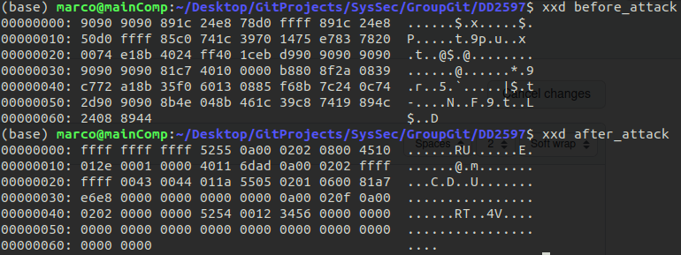

# DD2597
Project Repository for Group 4

### Collaborators: 
* Oliver Wilén 
* Marco Godow
* Sebastian Veijalainen 
* Marcus Dypbukt Källman

## How to start monitor:
Minix should be able to build normally using the releasetools. 
Before starting minix, virtio needs to be used. We use this command to start minix with virtio enabled.
`
qemu-system-i386 --enable-kvm -m 256 -hda minix_x86.img -nic user,id=u1,model=virtio-net-pci
`
To activate the monitor, the virtio net driver needs to be used. This is done using netconf.
In the Minix terminal use the netconf command and pick the vi0 driver. Then either restart Minix or the network service with service network restart.

# Vulnerabilities
## Data Leak Attack
The data leak attack and guide is on the branch sebvei_extend_attack.

## Data Overwrite Attack
The data Overwrite attack was created by first getting the info of where the kernel space is located, since we wanted to create a kernel panic.
Later on we then used this adress to tell the virtio_net driver to write to this location instead of the previous location that would have been added to the physical buffer in virtio_to_queue. The result is that you will be able to overwrite any part of memory defined by the adress you choose in the virtio_net driver with the data from the packet.
Below is a screenshot of the memory located in the kernel adress space before and after the attack.

To get these memory dump files one has to use the monitor mode in qemu, which is accesed by Ctrl + Alt + 2. Afterwards you can take a memorydump with pmemsave addr size file. The "addr" attribute can be found out by uncommenting line 246 in virtio_net.c //printf("%lu",kinfo.mem_high_phys); //268304384
We then take this addr "-100" an arbitrary number that gets us from highest kernel region into the kernel space. Afterwards we compare this memory before we have done the netconf and network restart described above. 

This attack used to crash the kernel(can be seen in marcoTest) but since recent changes it does not cause a kernel panic anymore even tough we can see it still overwrites parts that belong to the kernel. It is possible that some updates might have shifted locations of things that reside inside kernel space and at -100 is nothing that will cause the kernel to panic.

