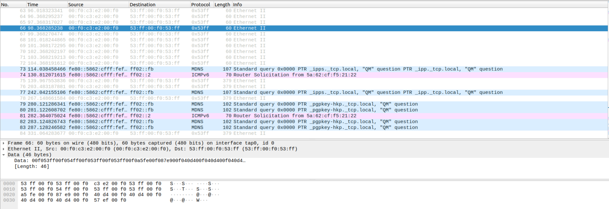
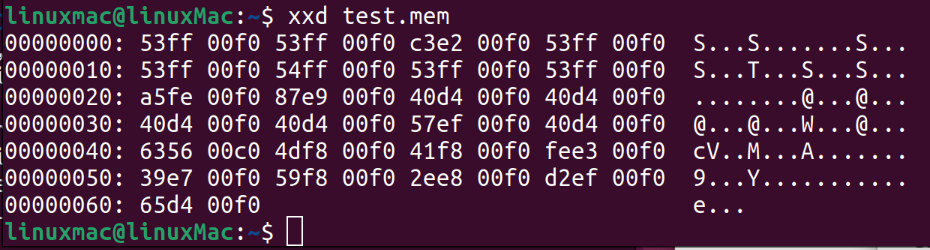

# DD2597
Project Repository for Group 4
# Vulnerabilities
## Data leak
A corrupt driver can make the NIC leak data from places it shouldn't. If we for example change the following line in irtio_net_send() from [virtio_net.c](minix/drivers/net/virtio_net/virtio_net.c)
```c
phys[1].vp_addr = p->pdata;		--->		phys[1].vp_addr = 0;
```
The NIC will then read from address 0 instead and send that data out.
If run Minix with the changed line and capture the packets using Wireshark, we get the following traffic.

We can see that all packets contain the same data and should be the data at address 0 in memory. To confirm we can take a memory dump of our Minix instance and check if the data matches. Here is the first 100 bytes of the memory dump where we can see the data matches the leaked data.

## Data overwrite
Collaborators: Oliver Wilén,Marco Godow,Sebastian Veijalainen, Marcus Dypbukt Källman


